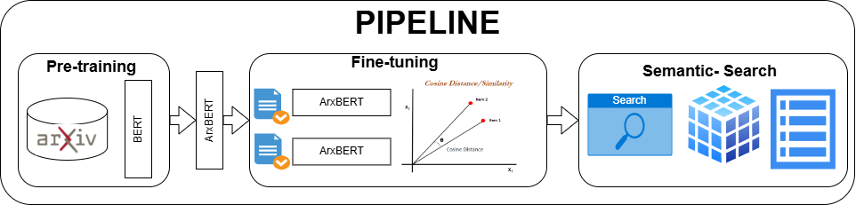
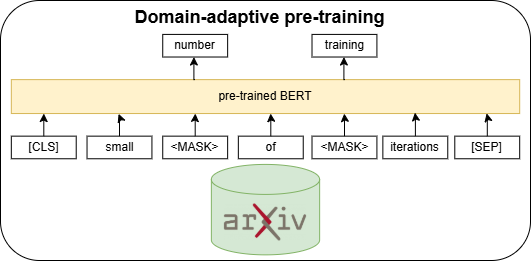
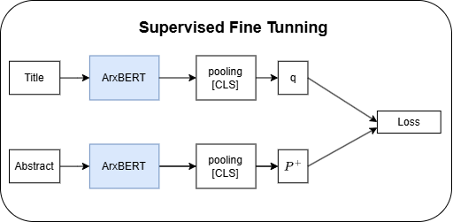

# **Enhancing the Search for Scientific Articles: An Embedding Fine-Tuning Approach for Efficient Retrieval**

**Course:** MC959/MO810 – Topics in Artificial Intelligence (Introduction to Self-Supervised Learning)

**Teacher:** Dr. Marcelo da Silva Reis

**Authors:**

- **Luis F. Solis Navarro**  
  Email 📧: [l214616@dac.unicamp.br](mailto:l214616@dac.unicamp.br)  
  RA: 214616

- **Ronaldinho Vega Centeno Olivera**  
  Email 📧: [r183585@dac.unicamp.br](mailto:r183585@dac.unicamp.br)  
  RA: 183585

- **Gabriel Ukstin Talasso**  
  Email 📧: [g2350785@dac.unicamp.br](mailto:g2350785@dac.unicamp.br)  
  RA: 235078

- **Alexander Puma Pucho**  
  Email 📧: [a259936@dac.unicamp.br](mailto:a259936@dac.unicamp.br)  
  RA: 259936


# Methodology

The methodology consists of a two-stage approach aimed at adapting a pre-trained language model for the academic domain, specifically targeting the retrieval of relevant scientific papers. The first stage involves self-supervised pre-training of the model on a large corpus of scientific articles, while the second stage consists of supervised fine-tuning to optimize the model for semantic similarity-based retrieval tasks. 


The overall workflow is outlined below, illustrating the two main stages: domain-specific pre-training and supervised fine-tuning.

## Stage 1: Self-supervised Domain-adaptive Pre-training

In the first stage, we focus on adapting the pre-trained BERT model to the scientific domain by continuing its training using a self-supervised approach. Specifically, we utilize the **Masked Language Modeling (MLM)** task, where the model is trained to predict masked words in a sentence. This process enables the model to better capture the linguistic structures and terminology commonly found in scientific literature.

The model is pre-trained using a large corpus of scientific abstracts from the arXiv dataset, focusing on research papers across various domains like physics, computer science, and mathematics. The pre-training is carried out without requiring labeled data, as MLM is a self-supervised task.



## Stage 2: Supervised Fine-tuning for Semantic Search

Once the domain-specific pre-training is complete, the next step is to fine-tune the model for the task of semantic search in scientific articles. The goal of this stage is to enable the model to generate embeddings that represent the semantic meaning of research articles, allowing for efficient similarity-based retrieval.

For this purpose, we employ a **Siamese Network** architecture, where two instances of the pre-trained model are used to process pairs of articles. The model is fine-tuned using a contrastive loss function that encourages the embeddings of semantically similar articles to be close together in vector space, while dissimilar articles are pushed farther apart. This enables more accurate similarity comparisons between user queries and the abstracts of scientific papers.



### Loss Function

We use the **Multiple Negatives Ranking Loss** to fine-tune the model. This loss function is designed to optimize the model’s ability to distinguish relevant (positive) pairs from irrelevant (negative) pairs. A positive pair consists of a query and its correct match, while all other samples in the batch are treated as negative pairs. One key feature of this loss function is the use of **in-batch negatives**, where all other examples in the same mini-batch serve as negative samples for each query. This approach makes training more efficient by using a large number of negative samples without the need to sample negatives externally.

The loss function is defined as follows:

```math
\mathcal{L} = - \log \left( \frac{\exp(\text{sim}(q, p_+))}{\exp(\text{sim}(q, p_+)) + \sum_{i=1}^{N} \exp(\text{sim}(q, p_i))} \right)
```
